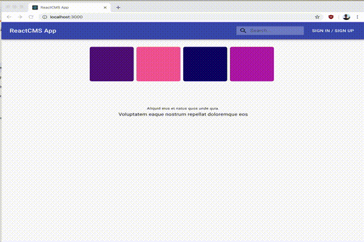

## ReactCMS, Tailwind and Framer Motion Demo

"Setup a project that contains React CMS and Tailwind. Add some creative intro animation using framer-motion."

## Notes
[ReactCMS readme](old.README.md)

I forked the ReactCMS repo, added Tailwind via PostCSS and added a simple intro animation using 
Framer Motion to the home page. I used Tailwind to style the animation. The animation is a simple 
position transition with a spring effect. See `client/package.json` scripts section for PostCSS Tailwind generation.  
See animation component source here: (client/src/containers/Contents/Animation.js).

I tried to leave the rest of the ReactCMS project as is, though I did add a docker-compose config to bring up Mongo and
I updated React in order to use hooks. 
 
## Pre-requisites
* `npm` & `node` <= v11.10.1 (ReactCMS has some deps that don't play well with latest Node)
* `docker` and `docker compose` or `mongodb`

* `npm install` in `server` and `client` 
* If you do not have a mongo db running localy: `docker-compose up db`
* Import the seed data: `mongoimport -d reactcms -c sites --file sites.json`
* `npm start` in `server` and `client`
* Optionally, if you run into errors with node-sass, `npm rebuild node-sass`

## Screencast

